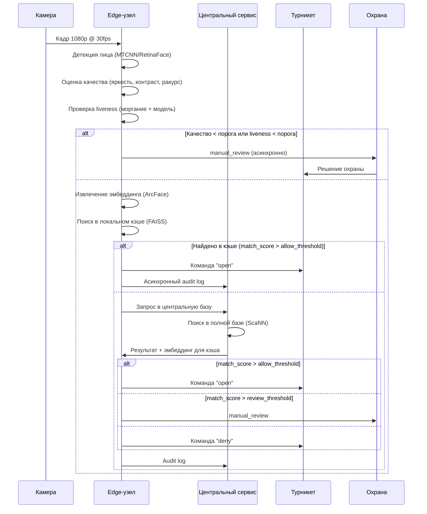

# Целевая архитектура системы распознавания лиц

## Основные компоненты

1. **Edge-узел (проходная)**
   - Камера 1080p/30fps с ИК подсветкой
   - NVIDIA Jetson Orin с GPU для инференса
   - Локальный кэш базы эмбеддингов (FAISS индекс)
   - Модуль принятия решений с порогами
   - Локальный лог событий

2. **Центральный сервис (cloud/on-prem)**
   - API Gateway для событий от edge
   - База сотрудников (PostgreSQL) с access policy
   - Хранилище эмбеддингов (FAISS/ScaNN) для 100k+ лиц
   - Сервис управления моделями и порогами
   - Audit log всех решений доступа
   - Интерфейс ручной проверки для охраны

3. **ML Pipeline (оффлайн)**
   - Обучение/дообучение моделей
   - Генерация эмбеддингов для новых сотрудников
   - Переиндексация ANN-индекса
   - Мониторинг дрифта и качества

## Поток данных от кадра до команды турникету

## Распределение вычислений: Edge vs Центр

**На Edge (синхронно, <200 мс):**
- Детекция лица и alignment
- Оценка качества кадра (правила)
- Проверка liveness (лёгкая модель)
- Извлечение эмбеддинга
- Поиск в локальном кэше (10k самых активных сотрудников)
- Принятие решения по порогам

**В Центре (синхронно/асинхронно):**
- Поиск в полной базе (100k+ сотрудников)
- Проверка access policy (график работы, отзыв доступа)
- Обновление локальных кэшей edge-узлов
- Агрегация audit log
- Обучение моделей и мониторинг

**Почему гибридный подход:**
- Edge: низкая задержка, работа при потере сети
- Центр: единая точка истины, сложные вычисления, масштабирование

## Хранилища

1. **База сотрудников (PostgreSQL)**
   - employee_id, имя, отдел
   - Статус (активен/уволен)
   - Access policy: график работы, зоны доступа
   - Хэш исходного изображения (не само изображение)

2. **Хранилище эмбеддингов + ANN-индекс (FAISS/ScaNN)**
   - 512-dim эмбеддинги (ArcFace)
   - Индекс для поиска one-to-many
   - Версионность (обновление без downtime)
   - Шардирование по проходным для edge-кэшей

3. **Audit log (Time-series DB + S3)**
   - Все события доступа с метаданными
   - Изображения лиц (шифрованные, 30 дней)
   - Решения и причины
   - Интеграция с SIEM

4. **Edge кэш (локальная SSD)**
   - Подмножество эмбеддингов (10k самых активных)
   - Access policy для этих сотрудников
   - Версионность и TTL

## Интерфейс ручной проверки для охраны

**Web-интерфейс:**
- Список событий manual_review с приоритетами
- Side-by-side: кадр с камеры vs эталонное фото
- ML-анализ: качество, liveness_score, топ-5 кандидатов
- Однокликовое решение: allow/deny
- История решений и feedback loop

**Мобильное приложение (экстренные случаи):**
- Push-уведомления о сомнительных случаях
- Быстрое решение с фото сотрудника
- Геолокация (какая проходная)

## Запасные пути при сбоях

1. **Потеря сети с центральным сервисом:**
   - Edge работает в degraded mode
   - Только локальный кэш (10k сотрудников)
   - Все новые/уволенные сотрудники → manual_review
   - Локальное логирование, синхронизация при восстановлении

2. **Сбой модели на edge:**
   - Fallback на более лёгкую модель
   - Если и она недоступна → все события manual_review
   - Автоматический rollback на предыдущую версию

3. **Сбой камеры:**
   - Переключение на backup камеру (2 камеры на проходной)
   - Если обе не работают → карточный режим

4. **Сбой турникета:**
   - Уведомление охраны
   - Перенаправление потока на соседнюю проходную
   - Логирование инцидента

## Интеграция с турникетом

**Протокол:**
- REST API или WebSocket для low-latency
- Команды: open/close/status
- Подтверждение выполнения команды
- Health check каждые 30 секунд

**Идемпотентность:**
- Каждое событие имеет unique event_id
- Повтор команды с тем же event_id игнорируется
- Таймаут команды: 5 секунд → manual_review

**Безопасность:**
- Mutual TLS между edge и турникетом
- Одноразовые команды с TTL
- Аудит всех команд в audit log